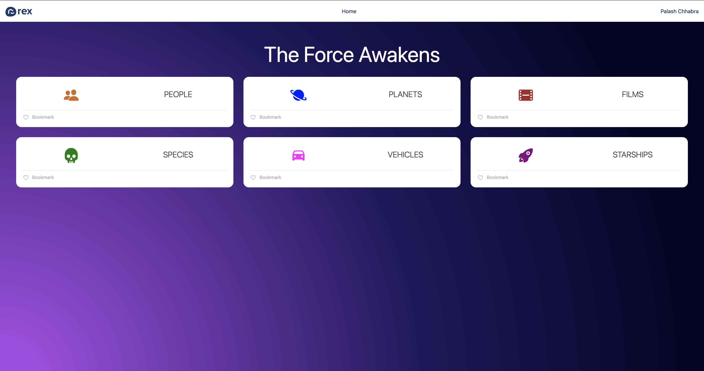
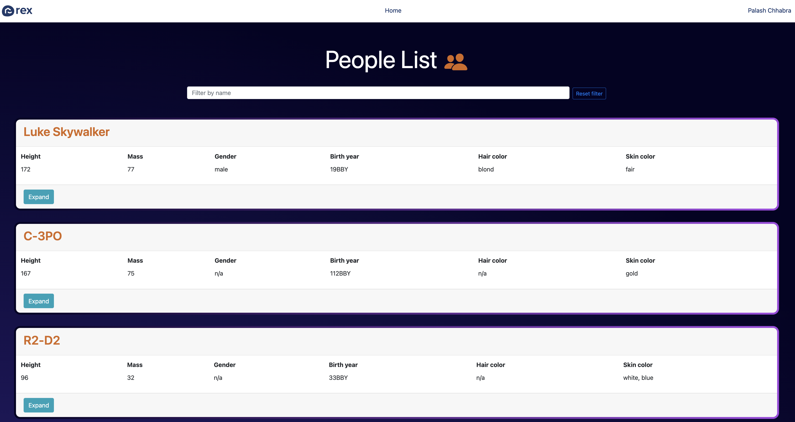

# Starwars App Challenge

Watch Live at : [Palash - Starwars](palash-starwars.netlify.app) [](https://app.netlify.com/sites/palash-starwars/deploys)

Simple React app Frontend for ingesting the [Star Wars API](https://swapi.dev/).
## How to setup

```
Step : 1 - Clone the repository and change directory to root (Node >=10 should be installed)
Step : 2 - Install node modules using npm i or yarn install
Step : 3 - Serve the app locally using npm start or yarn start
Step : 4 - Run test cases using npm run test
```
## Overview

This is a simple website for the Star Wars API with the following features :

1. View all root types, and the resources inside them
2. Click though and see a detailed breakdown of the information on each resource type
4. Favorite a resource type using local storage
## Screenshots




## Technologies used

- Typescript for type checking
- React for Front-end
- Redux for state management
- Redux Saga as a middle ware
- Styled components for styling

## Testing

Unit-testing for utils done with Jest

```
npm run test
```
## Proposed improvements

- Fully responsive mobile view (using multiple breakpoints)
- increase unit & integration testing coverage
- add more type checks
